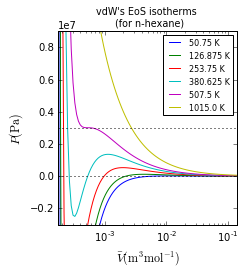
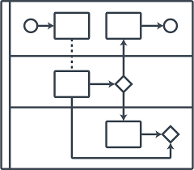

# Jupyter-Presentation

👩🏽‍🔬 👨🏽‍💻 👨🏿‍🏫 Reproducible Presentation and Publication workflows using Jupyter

- Jupyter Notebook post-save-hooks
  - Jupyter Lab (not all nbextensions)
  - maybe Grid Studio (not tested)
  - maybe VS Neuron (not integrated)
- RISE with React.js

## **WIP** Actuarial Engineering

  
Actuarial Engineering

  

<practices/actuarial-engineering>

## Python Basics

<https://github.com/AlexFiliakov/python-practice>

---

# References

## Notes, example code and datasets for the online course Jupyter Notebook for Data Science

<https://github.com/AlexFiliakov/Jupyter-Notebook-for-Data-Science>

## Saving your figs in publication quality format

[See cell In [19]: #bonus: some drafts for saving the fig in publication quality format](https://github.com/AlexFiliakov/PyTherm-applied-thermodynamics/blob/master/contents/main-lectures/2-numpy-matplotlib-vdW-EoS-isotherms.ipynb)

## LaTeX Motivating Examples

[Grabbed from https://github.com/odewahn/ipynb-examples](https://gist.github.com/AlexFiliakov/38bd5f23e5c979f6c150e595cfe81713)

# Future Enhancements

## BPMN Integration

<https://github.com/AlexFiliakov/bpmn-pyan>
